# 🧭 03. BẢN ĐỒ LUỒNG GỌI HÀM VÀ TRUY VẾT THỰC THI (CALL GRAPH & EXECUTION TRACE)

> **Dành cho Developer**: Tài liệu này mô tả trực quan bằng sơ đồ luồng đi của các hàm trong toàn bộ hệ thống (Call Graph) theo Kiến trúc Sạch 2.0 – **Ai gọi ai? Khi nào gọi? Dữ liệu truyền qua lại như thế nào?** từ lúc nạp ảnh, chạy pipeline 10 bước độc lập, render dòng chảy dữ liệu thời gian thực cho đến khi lưu log và xuất file.

---

## 1. 🗺️ Sơ Đồ Tổng Quan Luồng Gọi Hàm (Master Call Graph)

```mermaid
flowchart TD
    subgraph S1 ["Giai đoạn 1: Khởi động & Nhập liệu"]
        A1[Mở Chrome Extension] --> B1["ui/app.js: initializeApp()"]
        B1 --> C1["workflowView.js: initWorkflowView()"]
        C1 --> D1["workflowInput.js: bindInputEvents()"]
        C1 --> E1["autoTabs.js: checkAllSessions()"]
        UserImg[User nạp ảnh + SKU] --> F1["workflowInput.js: validateInputForm()"]
        F1 --> G1[Bật sáng #wfBtnStartPipeline]
    end

    subgraph S2 ["Giai đoạn 2: Kích hoạt Pipeline"]
        G1 -->|Click Start| H1["workflowView.js: startPipelineExecution()"]
        H1 --> I1["workflowView.js: switchWorkflowScreen('screenWorkflowProgress')"]
        H1 --> J1["workflowInspector.js: updateProgressUI(0)"]
        H1 --> K1["workflowFeeds.js: resetVerticalFeedUI()"]
        H1 --> L1["pipeline.js: runPipeline(input, callbacks)"]
    end

    subgraph S3 ["Giai đoạn 3: Chuỗi 10 Bước Xử Lý Độc Lập"]
        L1 --> M0["pipelineSteps.js: runStep0_AutoTabs()"]
        M0 -->|Mở tab ngầm| N0["autoTabs.js: ensureRequiredTabsOpen()"]

        L1 --> M1["pipelineSteps.js: runStep1_1688ImageSearch()"]
        M1 -->|Gọi 1688 SDK| N1["alibabaSDK: searchByImage()"]
        N1 -->|Tối ưu ảnh| O1["image-utils.js: compressImage()"]

        L1 --> M2["pipelineSteps.js: runStep2_1688Details()"]
        M2 -->|Chi tiết offer| N2["alibabaSDK: getOfferDetail()"]

        L1 --> M3["pipelineSteps.js: runStep3_Clean1688()"]
        M3 -->|Lọc rác xưởng| N3["cleaner.js: clean1688Offer()"]

        L1 --> M4["pipelineSteps.js: runStep4_GeminiKeywords()"]
        M4 -->|Sinh từ khóa| N4["geminiSDK: generateContent()"]

        L1 --> M5["pipelineSteps.js: runStep5_ShopeeSearch()"]
        M5 -->|Quét Shopee PH| N5["shopeeSDK: searchItems()"]

        L1 --> M6["pipelineSteps.js: runStep6_TikTokVideos()"]
        M6 -->|Thu hoạch video| N6["tiktokSDK: searchVideos()"]
        N6 -->|In-Tab Scripting| O6["transport.js: executeTabScripting()"]

        L1 --> M7["pipelineSteps.js: runStep7_EnrichPricing()"]
        M7 -->|Đối sánh giá buôn/lẻ| N7["enricher.js: mergeProductData()"]

        L1 --> M8["pipelineSteps.js: runStep8_ShopeeReviews()"]
        M8 -->|Trích xuất 10 review 5⭐| N8["enricher.js: extractTopReviews()"]

        L1 --> M9["pipelineSteps.js: runStep9_PackageManifest()"]

        %% Callbacks thời gian thực
        L1 -.->|onProgress| P1["workflowInspector.js: updateProgressUI()"]
        L1 -.->|onProgress| P2["workflowFeeds.js: updateDataInspectorUI()"]
        L1 -.->|onError| Q1["workflowInspector.js: showErrorDebugUI()"]
        L1 -.->|onCaptcha| Q2["workflowInspector.js: showCaptchaWarning()"]
    end

    subgraph S4 ["Giai đoạn 4: Hoàn Tất & Xuất File (Bảo Lưu Logs)"]
        L1 -->|Callback onComplete| R1["workflowResultView.js: renderResultScreen()"]
        R1 --> R2["workflowResultView.js: syncTerminalLogsToResult()"]
        R1 --> R3["workflowView.js: switchWorkflowScreen('screenWorkflowResult')"]

        R3 -->|Click Tải ZIP| S1_Zip["workflowResultView.js: bindResultEvents()"]
        S1_Zip --> S2_Zip["exporter.js: createZipBundle()"]
        S2_Zip -->|chrome.runtime.sendMessage| S3_Zip["background.js: triggerDownload()"]

        R3 -->|Click Copy TSV| T1_Tsv["exporter.js: generateTsvString()"]
        T1_Tsv --> T2_Tsv["exporter.js: copyTsvToClipboard()"]
    end
```

---

## 2. 🔍 Bảng Truy Vết Từng Luồng Nghiệp Vụ (Execution Trace Tables)

### 📌 LUỒNG 1: Khởi Động Extension & Kiểm Tra Phiên Ban Đầu
| Bước | Hàm Thực Thi | Nằm trong File | Nhiệm vụ chi tiết | Hàm gọi tiếp theo |
|:---:|:---|:---|:---|:---|
| 1.1 | `window.addEventListener('DOMContentLoaded')` | `ui/app.js` | Lắng nghe khi trình duyệt nạp xong HTML. | Gọi `initializeApp()`. |
| 1.2 | `initializeApp()` | `ui/app.js` | Khởi tạo 5 SDK Client (`gemini`, `shopee`, `tiktok`, `alibaba`, `lens`). | Gọi `initWorkflowView()`. |
| 1.3 | `initWorkflowView(clients)` | `ui/modules/workflowView.js` | Kết nối các sub-module giao diện. | Gọi `bindInputEvents()`, `bindProgressEvents()`, `bindResultEvents()`, `bindWarningEvents()`. |
| 1.4 | `checkAllSessions()` | `ui/modules/autoTabs.js` | Quét tab 1688, Shopee, TikTok, Gemini. | Cập nhật màu xanh/xám cho dải badge ở Màn hình 1. |

---

### 📌 LUỒNG 2: Người Dùng Nhập Ảnh & Mã SKU
| Bước | Hàm Thực Thi | Nằm trong File | Nhiệm vụ chi tiết | Hàm gọi tiếp theo |
|:---:|:---|:---|:---|:---|
| 2.1 | `handleFileSelect(file)` hoặc `setImageSource(url)` | `ui/modules/workflow/workflowInput.js` | Người dùng chọn file ảnh từ máy tính hoặc dán link ảnh web. | Đọc Base64, hiển thị ảnh preview HD `#wfPreviewBox`. |
| 2.2 | `inputSku.addEventListener('input')` | `ui/modules/workflow/workflowInput.js` | Tự động viết hoa toàn bộ ký tự SKU nhập vào. | Gọi `validateInputForm()`. |
| 2.3 | `validateInputForm()` | `ui/modules/workflow/workflowInput.js` | Kiểm tra điều kiện: Có ảnh VÀ SKU >= 2 ký tự. | Bật `btnStart.disabled = false`, thêm viền phát sáng `wf-btn-glow`. |

---

### 📌 LUỒNG 3: Bấm [Bắt Đầu Pipeline] ➔ Thực Thi 10 Bước Độc Lập
| Bước | Hàm Thực Thi | Nằm trong File | Nhiệm vụ chi tiết | Hàm gọi tiếp theo |
|:---:|:---|:---|:---|:---|
| 3.1 | `btnStart.onclick` | `ui/modules/workflow/workflowInput.js` | Kích hoạt callback khởi động. | `workflowView.js: startPipelineExecution()`. |
| 3.2 | `startPipelineExecution()` | `ui/modules/workflowView.js` | Lấy SKU và ảnh, reset UI, chuyển màn hình sang `screenWorkflowProgress`. | Gọi `pipeline.runPipeline(input, callbacks)`. |
| 3.3 | `runPipeline(input, callbacks)` | `ui/modules/pipeline.js` | Facade lặp qua 10 bước độc lập trong `PIPELINE_STEPS_CONFIG`. | Gọi lần lượt các hàm `runStep0` đến `runStep9`. |
| 3.4 | `runStep0_AutoTabs()` | `ui/modules/pipeline/pipelineSteps.js` | Đảm bảo 4 sàn đã có tab mở ngầm. | `autoTabs.js: ensureRequiredTabsOpen()`. |
| 3.5 | `runStep1_1688ImageSearch()` | `ui/modules/pipeline/pipelineSteps.js` | Tìm kiếm bằng ảnh qua 1688 API, fallback In-Tab nếu cần. | `alibabaSDK: searchByImage()`. |
| 3.6 | `runStep2_1688Details()` | `ui/modules/pipeline/pipelineSteps.js` | Lấy chi tiết offer đầu tiên và bảng specs. | `alibabaSDK: getOfferDetail()`. |
| 3.7 | `runStep3_Clean1688()` | `ui/modules/pipeline/pipelineSteps.js` | Lọc sạch số ĐT TQ (11 số), WeChat, địa chỉ công xưởng. | `cleaner.js: clean1688Offer()`. |
| 3.8 | `runStep4_GeminiKeywords()` | `ui/modules/pipeline/pipelineSteps.js` | Sinh 6 từ khóa Shopee PH (Anh - Tagalog) và 3 TikTok queries. | `geminiSDK: generateContent()`. |
| 3.9 | `runStep5_ShopeeSearch()` | `ui/modules/pipeline/pipelineSteps.js` | Quét Shopee PH, xử lý an toàn `.title || .name`. | `shopeeSDK: searchItems()`. |
| 3.10| `runStep6_TikTokVideos()` | `ui/modules/pipeline/pipelineSteps.js` | Thu hoạch video TikTok, phân loại theo lượt Tym. | `tiktokSDK: searchVideos()`. |
| 3.11| `runStep7_EnrichPricing()` | `ui/modules/pipeline/pipelineSteps.js` | Đối sánh giá buôn 1688, giá bán lẻ Shopee PH và tính biên lợi nhuận. | `enricher.js: mergeProductData()`. |
| 3.12| `runStep8_ShopeeReviews()` | `ui/modules/pipeline/pipelineSteps.js` | Trích xuất 10 review 5 sao có hình ảnh và video thực tế. | `enricher.js: extractTopReviews()`. |
| 3.13| `runStep9_PackageManifest()` | `ui/modules/pipeline/pipelineSteps.js` | Đóng gói đối tượng manifest tổng hợp. | Gọi `callbacks.onComplete(finalState)`. |
| 3.14| `onProgress(step, pct, title, detail)` | Callback Handler | Cập nhật tiến độ % và cập nhật trực tiếp dòng chảy 5 tầng dữ liệu. | `workflowInspector.updateProgressUI()`, `workflowFeeds.updateDataInspectorUI()`. |

---

### 📌 LUỒNG 4: Hoàn Tất, Bảo Lưu Logs & Xuất File
| Bước | Hàm Thực Thi | Nằm trong File | Nhiệm vụ chi tiết | Hàm gọi tiếp theo |
|:---:|:---|:---|:---|:---|
| 4.1 | `onComplete(state)` | Callback Handler | Bắn tín hiệu khi quy trình hoàn thành 100%. | Gọi `renderResultScreen(state)`, chuyển màn hình kết quả. |
| 4.2 | `renderResultScreen(state)` | `ui/modules/workflow/workflowResultView.js` | Render 5 tab kết quả (Video, Review, Specs, Process Data, Logs). | Gọi `syncTerminalLogsToResult()`. |
| 4.3 | `syncTerminalLogsToResult()` | `ui/modules/workflow/workflowResultView.js` | **Sao chép toàn bộ Terminal Log sang màn hình kết quả mà KHÔNG xóa log cũ**. | Log được bảo lưu 100% trong `#wfResultLogOutput`. |
| 4.4 | `btnDownloadZip.onclick` | `ui/modules/workflow/workflowResultView.js` | Người dùng click tải file ZIP `{SKU}.zip`. | `exporter.js: createZipBundle()`. |
| 4.5 | `createZipBundle(state)` | `ui/modules/exporter.js` | Nén ảnh, JSON reviews, videos thành Blob. | Gửi message `'TRIGGER_DOWNLOAD'` tới `background.js`. |
| 4.6 | `btnCopyTsv.onclick` | `ui/modules/workflow/workflowResultView.js` | Người dùng click sao chép bảng tính TSV. | `exporter.js: generateTsvString()`, `copyTsvToClipboard()`. |

---

## 3. 🧩 Bảng Ma Trận Lời Gọi Hàm (Caller vs Callee Matrix)

| Module Gọi (Caller) | Hàm Gọi (Caller Function) | Module Bị Gọi (Callee) | Hàm Được Gọi (Callee Function) |
|:---|:---|:---|:---|
| `ui/app.js` | `initializeApp()` | `ui/modules/workflowView.js` | `initWorkflowView(clients)` |
| `workflowInput.js` | `bindInputEvents()` | `ui/modules/workflowView.js` | `startPipelineExecution()` |
| `workflowView.js` | `startPipelineExecution()` | `ui/modules/pipeline.js` | `runPipeline(input, callbacks)` |
| `workflowView.js` | `startPipelineExecution()` | `workflowFeeds.js` | `resetVerticalFeedUI()` |
| `workflowView.js` | `startPipelineExecution()` | `workflowInspector.js` | `updateProgressUI(0, 0, ...)` |
| `pipeline.js` | `runPipeline()` | `pipeline/pipelineState.js` | `checkPauseOrAbort()`, `initPipelineState()` |
| `pipeline.js` | `runPipeline()` | `pipeline/pipelineSteps.js` | `runStep0_AutoTabs()` đến `runStep9_PackageManifest()` |
| `pipelineSteps.js` | `runStep1_1688ImageSearch()` | `sdk/1688/client.js` | `alibaba.searchByImage(image)` |
| `sdk/1688/client.js`| `uploadImage()` | `sdk/1688/image-utils.js` | `compressImage()`, `normalizeImageToBase64()` |
| `pipelineSteps.js` | `runStep3_Clean1688()` | `ui/modules/cleaner.js` | `clean1688Offer(rawOffer)` |
| `pipelineSteps.js` | `runStep4_GeminiKeywords()` | `sdk/gemini/client.js` | `gemini.generateContent({ prompt })` |
| `pipelineSteps.js` | `runStep5_ShopeeSearch()` | `sdk/shopee/client.js` | `shopee.searchItems(keyword, options)` |
| `pipelineSteps.js` | `runStep6_TikTokVideos()` | `sdk/tiktok/client.js` | `tiktok.searchVideos(keyword, options)` |
| `sdk/tiktok/client.js`| `searchVideos()` | `sdk/tiktok/transport.js`| `executeTabScripting()`, `waitForTabComplete()` |
| `pipelineSteps.js` | `runStep7_EnrichPricing()` | `ui/modules/enricher.js` | `mergeProductData(cleaned1688, shopeeShops)` |
| `pipelineSteps.js` | `runStep8_ShopeeReviews()` | `ui/modules/enricher.js` | `extractTopReviews(shopeeShops, 10)` |
| `pipeline.js (Callback)`| `onProgress` | `workflowFeeds.js` | `updateDataInspectorUI(pipelineState)` |
| `pipeline.js (Callback)`| `onComplete` | `workflowResultView.js` | `renderResultScreen(state)`, `syncTerminalLogsToResult()` |
| `pipeline.js (Callback)`| `onError` | `workflowInspector.js` | `showErrorDebugUI(err, stepIndex, rawDetails)` |
| `workflowResultView.js`| `bindResultEvents()` | `ui/modules/exporter.js` | `createZipBundle()`, `generateTsvString()` |
| `exporter.js` | `createZipBundle()` | `background.js` | `chrome.runtime.sendMessage({ action: 'TRIGGER_DOWNLOAD' })` |

---
*Tài liệu kết thúc. Toàn bộ bản đồ luồng gọi hàm và ma trận tương tác đã được chuẩn hóa 100% theo Clean Architecture 2.0.*
