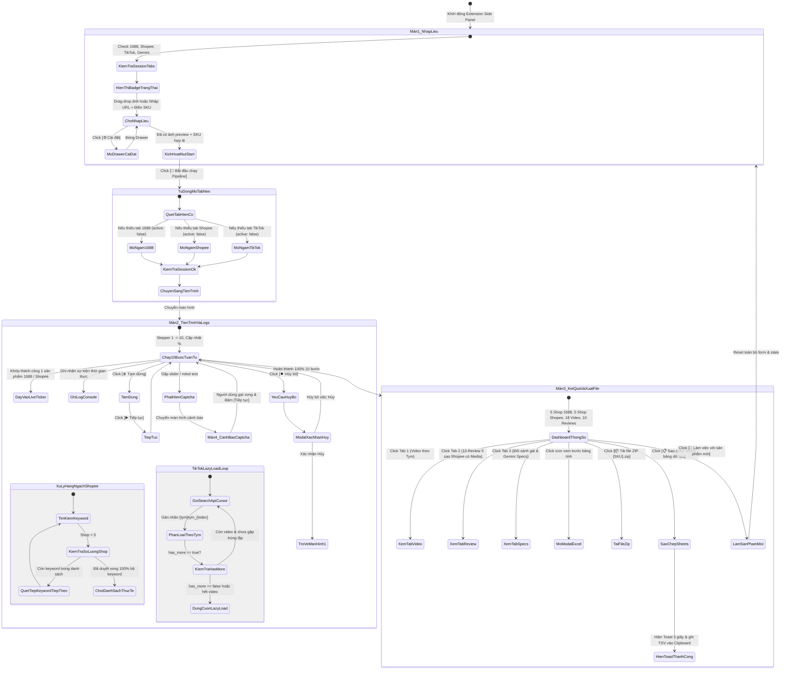

# 🗺️ 05. SƠ ĐỒ LUỒNG TƯƠNG TÁC NGƯỜI DÙNG TOÀN DIỆN (INTERACTIVE USER FLOW & STATE TRANSITIONS)

> **Mục tiêu**: Mô tả toàn bộ các trạng thái chuyển đổi giữa các màn hình, hành vi tương tác khi có lỗi/captcha, khi tạm dừng, khi xử lý hàng ngách quét 100% từ khóa, và khi tải file ZIP / sao chép bảng tính.

---

## 🔄 1. Sơ Đồ Chuyển Trạng Thái Giao Diện Toàn Cục (Global State Diagram)

---

## 🎯 2. Ma Trận Tương Tác & Phản Hồi Giao Diện Chi Tiết

| Thao tác người dùng | Vị trí màn hình | Phản hồi giao diện trực quan | Tác vụ ngầm xử lý |
|:---|:---|:---|:---|
| **Kéo file ảnh vào Dropzone** | Màn hình 1 | Viền Dropzone chuyển xanh Neon, phóng to 1.02, đổi icon sang nạp file. | Bắt sự kiện `dragover`, `preventDefault()`. |
| **Thả file ảnh vào Dropzone** | Màn hình 1 | Hiện khung xem trước ảnh HD, dung lượng KB, kích thước pixel. | `FileReader.readAsDataURL(file)`. |
| **Dán URL ảnh** | Màn hình 1 | Hiển thị mini spinner tải ảnh, fetch blob để kiểm tra ảnh hợp lệ. | `fetch(url) -> Image preview`. |
| **Gõ mã SKU** | Màn hình 1 | Tự động chuyển thành CHỮ HOA, kiểm tra không chứa ký tự cấm. | Chuẩn hóa `sku.toUpperCase().trim()`. |
| **Click [⚙️ Cài đặt]** | Màn hình 1 | Drawer cài đặt trượt từ cạnh phải ra, hiển thị các toggle và tab IDs. | Mở offcanvas drawer `#settingsDrawer`. |
| **Click [Start Pipeline]** | Màn hình 1 ➔ 2 | Trượt chuyển sang Màn 2, thanh tiến trình bắt đầu chạy, đồng hồ đếm giây. | Kiểm tra & mở tab ngầm nếu thiếu (`chrome.tabs.create`), kích hoạt `runPipeline()`. |
| **Khớp thành công 1 sản phẩm** | Màn hình 2 | Card ảnh trượt ngang từ phải sang trái vào thanh Live Thumbnail Ticker. | Chèn element vào `#liveThumbnailTicker`. |
| **Gặp hàng ngách Shopee** | Màn hình 2 | Huy hiệu bước 5 chuyển màu cam, hiển thị tiến độ quét `Duyệt từ khóa 4/5...` | Tiếp tục lặp `allKeywords`, không dừng cho đến khi quét xong 100%. |
| **TikTok phân trang Lazy-load** | Màn hình 2 | Hiển thị số lượng video tăng dần theo từng trang API, tự ngắt khi `has_more == false`. | Vòng lặp phân trang API TikTok SDK, phân loại `{tym}tym_{index}`. |
| **Gặp Captcha / Slider** | Màn hình 2 ➔ 4 | Tạm dừng pipeline, hiển thị màn hình đỏ cảnh báo và nút mở tab giải captcha. | `isPaused = true`, chờ user giải xong bấm `Resume`. |
| **Click [⏸️ Tạm dừng]** | Màn hình 2 | Đổi icon thành `[▶️ Tiếp tục]`, thanh tiến độ đóng băng, giữ nguyên RAM. | Đặt cờ `isPaused = true`. |
| **Click [⏹️ Hủy bỏ]** | Màn hình 2 | Hiển thị Popup xác nhận mờ kính. | Ngừng vòng lặp nếu người dùng đồng ý. |
| **Hoàn thành 100%** | Màn hình 2 ➔ 3 | Trượt chuyển sang Màn 3, bảng chỉ số phát sáng xanh lục hoàn thành. | Render dữ liệu vào 3 Tab và bộ nhớ xuất file. |
| **Click các Tab xem trước** | Màn hình 3 | Chuyển đổi mượt mà giữa Tab Video (Tym), Tab Review (Media) và Tab Specs (Giá). | Đổi class `active` cho tab content tương ứng. |
| **Click [📋 Sao chép nhanh]** | Màn hình 3 | Nút chuyển màu xanh ngọc, Toast trượt lên: "Đã sao chép 24 cột vào Clipboard!". | `navigator.clipboard.writeText(tsvData)`. |
| **Click [📦 Tải file ZIP]** | Màn hình 3 | Hiện spinner nén file, sau đó kích hoạt trình duyệt lưu `{SKU}.zip`. | `JSZip.generateAsync() -> chrome.downloads.download()`. |
| **Click [🔄 Sản phẩm mới]** | Màn hình 3 ➔ 1 | Trượt về Màn 1, xóa sạch form và reset biến trạng thái runtime. | `resetAppState()`. |

---
*Bản quyền tài liệu thuộc Bộ hồ sơ Wireframe Dự án Chrome Extension Pipeline.*
