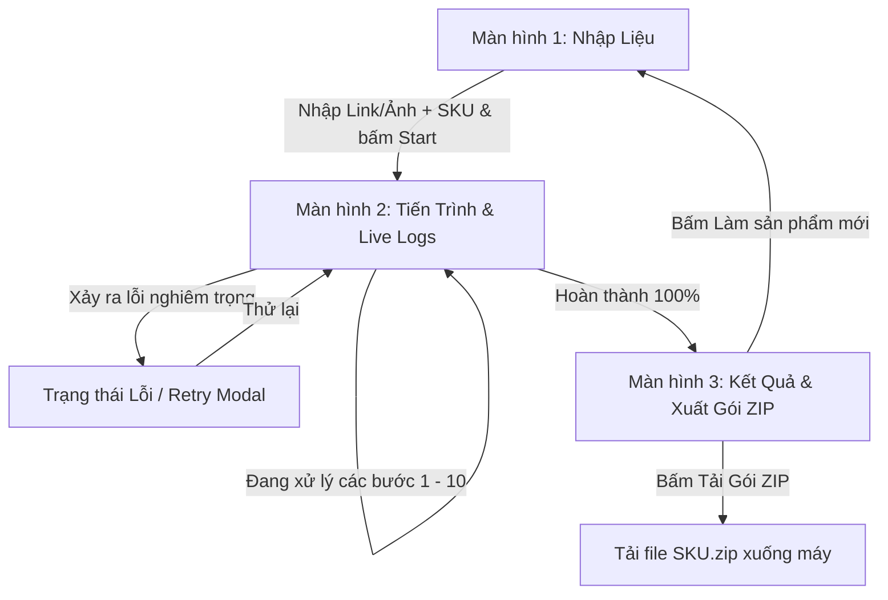

# 📱 Tài liệu Thiết kế Wireframe – Chrome Extension Pipeline

> **Mục đích**: Tài liệu này định nghĩa cấu trúc giao diện trực quan (Wireframe), luồng người dùng (User Flow), và các thành phần hiển thị cho Chrome Extension mà không can thiệp vào mã nguồn.

---

## 🗺️ 1. Sơ đồ Luồng Giao diện (User Flow Diagram)



---

## 🖥️ 2. Wireframe Chi tiết từng Màn hình

### 📌 MÀN HÌNH 1: NHẬP LIỆU ĐẦU VÀO (INPUT SCREEN)
* **Kích thước dự kiến**: Side-panel chuẩn Chrome Extension (rộng ~420px - 480px, cao 100vh).
* **Mục đích**: Tiếp nhận Link ảnh gốc (hoặc tải file ảnh) và Mã sản phẩm (SKU).

```text
+-------------------------------------------------------------------+
|  [⚡ Logo]  E-COMMERCE DATA HARVEST PIPELINE              [⚙️] [✕] |
|  Extension Version v2.1 • Multi-Platform Engine                   |
+-------------------------------------------------------------------+
|                                                                   |
|  [ 1. HÌNH ẢNH SẢN PHẨM GỐC ]                                     |
|  ┌─────────────────────────────────────────────────────────────┐  |
|  │  🔗 Nhập URL ảnh gốc:                                       │  |
|  │  [ https://example.com/product-master-image.jpg           ] │  |
|  └─────────────────────────────────────────────────────────────┘  |
|                                 -- HOẶC --                        |
|  ┌ - - - - - - - - - - - - - - - - - - - - - - - - - - - - - - ┐  |
|  │                     📁 Kéo thả file ảnh vào đây             │  |
|  │                               hoặc                          │  |
|  │                     [ 📂 Chọn ảnh từ máy tính ]             │  |
|  └ - - - - - - - - - - - - - - - - - - - - - - - - - - - - - - ┘  |
|                                                                   |
|  [ Khung Xem Trước Ảnh Gốc ]                                      |
|  ┌───────────────────────┬─────────────────────────────────────┐  |
|  │                       │  • Tên file: master_shoe_01.jpg     │  |
|  │     [ ẢNH SẢN PHẨM    │  • Kích thước: 800 x 800 px         │  |
|  │        PREVIEW ]      │  • Dung lượng: 184 KB               │  |
|  │                       │  • Trạng thái: ✅ Đã tải hợp lệ     │  |
|  └───────────────────────┴─────────────────────────────────────┘  |
|                                                                   |
|  [ 2. THÔNG TIN ĐỊNH DANH SẢN PHẨM ]                              |
|  ┌─────────────────────────────────────────────────────────────┐  |
|  │  🏷️ Mã sản phẩm (SKU) *:                                    │  |
|  │  [ SHOE-AIR-MAX-2026-BLK                                  ] │  |
|  └─────────────────────────────────────────────────────────────┘  |
|                                                                   |
|  [ 3. CẤU HÌNH NHANH (TÙY CHỌN) ]                                 |
|  ┌─────────────────────────────────────────────────────────────┐  |
|  │  🛒 Thị trường Shopee: [ Shopee Philippines (PH)       ▼ ]  │  |
|  │  🎬 Nền tảng Video:    [ TikTok & Douyin (Cả hai)      ▼ ]  │  |
|  │  🎯 Chỉ tiêu shop:     [ 5 shop hợp lệ (Mặc định)      ▼ ]  │  |
|  └─────────────────────────────────────────────────────────────┘  |
|                                                                   |
|  ┌─────────────────────────────────────────────────────────────┐  |
|  │               🚀 [ BẮT ĐẦU CHẠY PIPELINE ]                  │  |
|  │           (Tự động xác thực 1688, Shopee, TikTok)           │  |
|  └─────────────────────────────────────────────────────────────┘  |
|  ℹ️ Lưu ý: Hãy đảm bảo tab 1688 và TikTok đã đăng nhập sẵn session.|
+-------------------------------------------------------------------+
```

---

### 📌 MÀN HÌNH 2: TIẾN TRÌNH & LIVE LOGS (PIPELINE PROGRESS & LOGS)
* **Mục đích**: Theo dõi tiến độ thời gian thực của từng bước từ 1 đến 10, hiển thị trực quan các bộ đếm (`x/5 shop`, `x/80 video`), và khung console hiển thị toàn bộ log chi tiết.

```text
+-------------------------------------------------------------------+
|  [⚡ Logo]  PIPELINE ĐANG CHẠY: [SHOE-AIR-MAX-2026-BLK]   [⏸] [⏹] |
|  Trạng thái: ⏳ Đang cào dữ liệu Shopee • Thời gian: 01:24        |
+-------------------------------------------------------------------+
|                                                                   |
|  [ TIẾN ĐỘ TỔNG THỂ: 60% ]                                        |
|  [████████████████████████████████░░░░░░░░░░░░░░░░░░░░░░░░] 6/10  |
|                                                                   |
|  [ CÁC BƯỚC THỰC THI (PIPELINE STEPS) ]                           |
|  ┌─────────────────────────────────────────────────────────────┐  |
|  │  ✅ Bước 1: 1688 - Tìm ảnh & Gemini lọc      [ 5/5 Shop Đủ ] │  |
|  │  ✅ Bước 2: 1688 - Tải ảnh & mô tả 5 shop   [ 38 Ảnh, 5 HTML]│  |
|  │  ✅ Bước 3: Làm sạch thông tin nhà máy       [ Đã chuẩn hóa ]│  |
|  │  ✅ Bước 4: Tạo bộ từ khóa đa ngôn ngữ       [ 12 Keywords ] │  |
|  │  ✅ Bước 5: Shopee - Tìm kiếm theo từ khóa   [ 5/5 Shop Đủ ] │  |
|  │  🔄 Bước 6: TikTok/Douyin - Lấy API lazy-load[ 42 Videos... ]│  |
|  │     ↳ ⏳ API offset: 40 • has_more: true • Đang phân trang...│  |
|  │  ⏳ Bước 7: Làm giàu dữ liệu Shopee & Review [ Đang chờ... ] │  |
|  │  ⏳ Bước 8: Đặt tên video theo lượt Tym      [ Đang chờ... ] │  |
|  │  ⏳ Bước 9: Kiểm tra tính toàn vẹn Manifest  [ Đang chờ... ] │  |
|  │  ⏳ Bước 10: Đóng gói ZIP [SKU.zip]          [ Đang chờ... ] │  |
|  └─────────────────────────────────────────────────────────────┘  |
|                                                                   |
|  [ 📜 NHẬT KÝ HOẠT ĐỘNG THỜI GIAN THỰC (REALTIME LIVE LOGS) ]     |
|  Thanh công cụ: [🔘 Tự cuộn: BẬT] [📋 Sao chép] [🗑️ Xóa] [Lọc: ALL ▼]|
|  ┌─────────────────────────────────────────────────────────────┐  |
|  │ 20:58:01 [INFO] [System] Khởi động pipeline cho SKU: SHOE... │  |
|  │ 20:58:03 [INFO] [1688_SDK] Gọi searchByImage(master_01.jpg) │  |
|  │ 20:58:06 [INFO] [1688_SDK] Trang 1: Nhận 20 ứng viên ban đầu │  |
|  │ 20:58:09 [INFO] [GEMINI] Gửi 20 ảnh sang Gemini Vision đối...│  |
|  │ 20:58:12 [SUCCESS] [GEMINI] 3 shop khớp chuẩn sản phẩm gốc   │  |
|  │ 20:58:14 [INFO] [1688_SDK] Chuyển trang 2 để tìm đủ 5 shop...│  |
|  │ 20:58:18 [SUCCESS] [1688_SDK] Đạt mốc 5/5 shop hợp lệ!       │  |
|  │ 20:58:20 [INFO] [CLEANER] Đã loại bỏ thông tin xưởng Quảng...│  |
|  │ 20:58:23 [INFO] [GEMINI] Sinh 12 từ khóa Shopee PH & TikTok  │  |
|  │ 20:58:28 [SUCCESS] [SHOPEE] Quét 5 shop Shopee PH thành công │  |
|  │ 20:58:32 [INFO] [TIKTOK_SDK] Bắt đầu gọi API batch 1 (count:20)│
|  │ 20:58:35 [INFO] [TIKTOK_SDK] Batch 1: +20 videos, has_more=1 │  |
|  │ 20:58:37 [INFO] [TIKTOK_SDK] Bắt đầu gọi API batch 2 (offset:20)│
|  │ 20:58:40 [INFO] [TIKTOK_SDK] Batch 2: +22 videos, has_more=1 │  |
|  │ 20:58:42 [INFO] [TIKTOK_SDK] Đang gửi thumbnail sang Gemini...│  |
|  │ >_ Con trỏ log đang hoạt động...                             │  |
|  └─────────────────────────────────────────────────────────────┘  |
|                                                                   |
|  [ ĐIỀU KHIỂN TIẾN TRÌNH ]                                        |
|  ┌──────────────────────────────┬──────────────────────────────┐  |
|  │    ⏸️ [ TẠM DỪNG / PAUSE ]    │    ⏹️ [ HỦY BỎ / ABORT ]     │  |
|  └──────────────────────────────┴──────────────────────────────┘  |
+-------------------------------------------------------------------+
```

---

### 📌 MÀN HÌNH 3: KẾT QUẢ & XUẤT GÓI ZIP (RESULT & EXPORT SCREEN)
* **Mục đích**: Hiển thị tổng kết dữ liệu đã thu thập, xem trước thông tin làm giàu, danh sách video theo lượt tym, và nút tải về file ZIP mang tên mã sản phẩm (`<SKU>.zip`).

```text
+-------------------------------------------------------------------+
|  [⚡ Logo]  KẾT QUẢ PIPELINE: [SHOE-AIR-MAX-2026-BLK]       [✕]   |
|  Trạng thái: 🎉 HOÀN THÀNH XUẤT SẮC • Tổng thời gian: 02:15       |
+-------------------------------------------------------------------+
|                                                                   |
|  ┌─────────────────────────────────────────────────────────────┐  |
|  │  🎉 THÀNH CÔNG! DỮ LIỆU ĐÃ SẴN SÀNG ĐÓNG GÓI                │  |
|  │  Gói dữ liệu tiêu chuẩn: SHOE-AIR-MAX-2026-BLK.zip (~34 MB) │  |
|  └─────────────────────────────────────────────────────────────┘  |
|                                                                   |
|  [ 📊 THỐNG KÊ DỮ LIỆU THU THẬP ĐƯỢC ]                            |
|  ┌─────────────────────────┬───────────────────────────────────┐  |
|  │ 🏬 Shop 1688 xác thực:  │ 5 shop (Gốc xưởng TQ)             │  |
|  │ 🛍️ Shop Shopee PH:      │ 5 shop (Thương mại bán lẻ)        │  |
|  │ 🖼️ Tổng số hình ảnh:    │ 64 ảnh chất lượng cao             │  |
|  │ 🎬 Video TikTok/Douyin: │ 18 link video khớp (đã lọc Gemini)│  |
|  │ ⭐ Đánh giá 5 sao Shopee│ 10 đánh giá (kèm 14 ảnh + 3 clip) │  |
|  └─────────────────────────┴───────────────────────────────────┘  |
|                                                                   |
|  [ 📑 TABS XEM TRƯỚC DỮ LIỆU THU ĐƯỢC ]                           |
|  [ Tab: Video Links ]  [ Tab: Đánh Giá Shopee ]  [ Tab: Thuộc Tính ]|
|  ┌─────────────────────────────────────────────────────────────┐  |
|  │ 🎬 Danh sách video đã được chuẩn hóa theo số lượt Tym:      │  |
|  │  1. 310tym_1.mp4  • 310 lượt tym • Link: tiktok.com/@a/v1...│  |
|  │  2. 310tym_2.mp4  • 310 lượt tym • Link: douyin.com/video/2 │  |
|  │  3. 850tym_1.mp4  • 850 lượt tym • Link: tiktok.com/@b/v3...│  |
|  │  4. 1500tym_1.mp4 • 1.5K lượt tym• Link: douyin.com/video/4 │  |
|  │  5. 12400tym_1.mp4• 12.4K tym    • Link: tiktok.com/@c/v5...│  |
|  └─────────────────────────────────────────────────────────────┘  |
|                                                                   |
|  [ 📁 CẤU TRÚC GÓI ZIP XUẤT RA ]                                  |
|  📁 SHOE-AIR-MAX-2026-BLK.zip                                      |
|   ├── 📁 images/           (Ảnh gốc, ảnh 1688, ảnh Shopee)        |
|   ├── 📁 reviews/          (10 đánh giá 5 sao + link ảnh/clip)    |
|   ├── 📄 video_links.json  (Danh sách link video đặt tên theo tym)|
|   ├── 📄 enriched_data.json(Dữ liệu thông số làm giàu 1688+Shopee)|
|   └── 📄 manifest.json     (Tóm tắt siêu dữ liệu gói)             |
|                                                                   |
|  ┌─────────────────────────────────────────────────────────────┐  |
|  │         📥 [ TẢI VỀ GÓI ZIP: SHOEAIRMAX2026BLK.zip ]     │  |
|  └─────────────────────────────────────────────────────────────┘  |
|                                                                   |
|  [ 🔄 Làm việc với sản phẩm mới ]    [ 📂 Mở thư mục tải xuống ]  |
+-------------------------------------------------------------------+
```

---

## 🧩 3. Bảng Phân Rã Thành Phần Giao Diện (Component Hierarchy)

| Thành phần | ID đề xuất | Chức năng chính | Trạng thái hiển thị |
|------------|------------|-----------------|---------------------|
| **Input Image URL** | `inputProductImageUrl` | Tiếp nhận link URL ảnh trực tiếp | Luôn hiển thị ở Màn 1 |
| **Dropzone Upload** | `dropzoneImageFile` | Cho phép kéo thả hoặc duyệt file ảnh cục bộ | Luôn hiển thị ở Màn 1 |
| **Preview Container** | `boxImagePreview` | Hiển thị thumbnail và thông số ảnh đã chọn | Hiển thị khi đã có ảnh |
| **Input SKU** | `inputProductSku` | Nhập mã định danh sản phẩm | Bắt buộc để mở khóa nút chạy |
| **Start Button** | `btnStartPipeline` | Kích hoạt luồng thực thi nền | Disabled khi thiếu ảnh hoặc SKU |
| **Overall Progress Bar**| `progressBarOverall` | Thanh phần trăm tổng thể (0% -> 100%) | Hiển thị ở Màn 2 |
| **Step List / Timeline**| `pipelineStepList` | Hiển thị chi tiết trạng thái từng bước 1-10 | Cập nhật động theo trạng thái |
| **Live Log Console** | `terminalLogOutput` | Khung hiển thị log có màu theo thẻ [INFO], [WARN] | Cuộn tự động khi có log mới |
| **Log Controls** | `btnCopyLog`, `btnClearLog` | Sao chép log vào clipboard hoặc làm sạch | Hiển thị phía trên Log console |
| **Pause / Abort Buttons**| `btnPausePipeline`, `btnAbortPipeline` | Tạm dừng hoặc hủy khẩn cấp quy trình | Hiển thị ở Màn 2 |
| **Data Summary Card** | `cardDataSummary` | Bảng tổng hợp số liệu 1688, Shopee, TikTok | Hiển thị ở Màn 3 |
| **Download Zip Button** | `btnDownloadZip` | Kích hoạt tải gói ZIP mang tên `<SKU>.zip` | Hiển thị ở Màn 3 |

---

## 🎨 4. Nguyên Tắc Trải Nghiệm & Trạng Thái Tương Tác (UI/UX Guidelines)

1. **Quy ước Màu sắc Log (Terminal Aesthetics)**:
   - `[INFO]`: Màu xanh dương pastel (`#38bdf8`) – thông tin diễn biến.
   - `[SUCCESS]`: Màu xanh lá tươi (`#4ade80`) – hoàn thành bước hoặc điều kiện dừng đạt chuẩn.
   - `[WARN]`: Màu vàng cam (`#facc15`) – số shop không đủ 5 hoặc chạm rate-limit tạm thời.
   - `[ERROR]`: Màu đỏ san hô (`#f87171`) – lỗi mạng hoặc session hết hạn.
2. **Quy tắc Tên File ZIP**:
   - File nén tải về bắt buộc đặt theo mã SKU được nhập ở màn hình 1: `{SKU}.zip` (ví dụ: `SHOE-AIR-MAX-2026-BLK.zip`).
3. **Quy tắc Lưu Trữ Video**:
   - Theo đúng yêu cầu cập nhật: **Chỉ lưu danh sách URL/link video**, không tải file video nhị phân nặng về máy để tối ưu tốc độ và dung lượng gói zip. File `video_links.json` lưu trữ URL kèm tên định danh theo lượt tym (`310tym_1`, `310tym_2`...).
4. **Tái sử dụng SDK có sẵn**:
   - Không tạo mới logic gọi mạng tự phát; toàn bộ luồng kết nối đều thông qua các SDK có sẵn tại `sdk_utility/` (`1688_sdk`, `shopee_sdk`, `tiktok_douyin_sdk`, `google_lens_sdk` / `gemini_sdk`).

---
*Tài liệu wireframe được lưu trữ tại `docs/wireframes/pipeline_wireframes.md`.*
